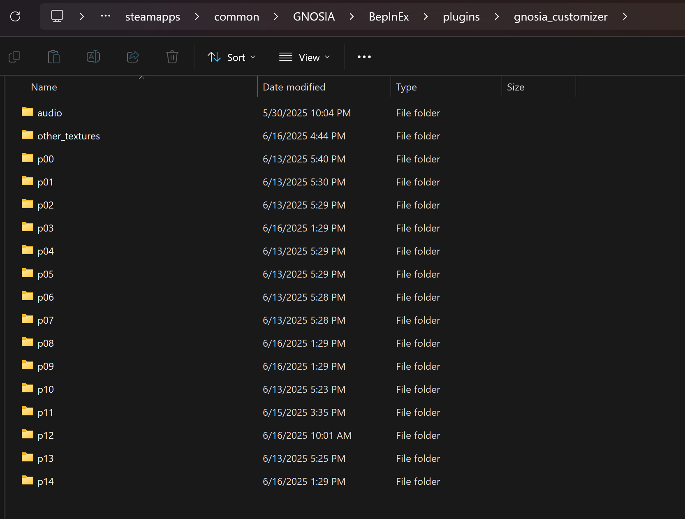

# gnosia-customizer (WIP)

A mod based on BepinEx/Harmony that allows substituting custom sprites in places of the current character sprites, as well as other customizations.

## Prototype features:

The following assets can be modified: 

Characters
 * Sprites
 * Name
 * Attributes
 * Ability points
 * Known skills
 * Dialogue
 
Other
 * Textures
 * BGM + SFX

Not currently supported:
 * Love
 * Preferred places

## Example quick start guide

1. [Install BepInEx](https://docs.bepinex.dev/articles/user_guide/installation/index.html).
2. Run Gnosia once to create the plugins folder.
3. Place `GnosiaCustomizer.dll` into the plugins folder.
3. Unzip the `example_assets.zip` into the plugins folder. The file structure should look similar to: 
4. Open the game. If the menu music is changed, this is a sign that the new assets have loaded.

## Customizations

Here's a quick guide on how to use each of the customizations that the tool can offer.

### Character sprites

There are 14 folders in the `gnosia_customizer` assets folder, each of which correspond to one character. This is the character that each folder corresponds to:

| ID | Name  |
|----|-------|
| p01  | Gina       |
| p02  | SQ         |
| p03  | Raqio      |
| p04  | Stella     |
| p05  | Shigemichi |
| p06  | Chipie     |
| p07  | Remnan     |
| p08  | Comet      |
| p09  | Yuriko     |
| p10 | Jonas      |
| p11 | Setsu      |
| p12 | Otome      |
| p13 | Sha-ming   |
| p14 | Kukrushka  |

Within each of these character folders, you'll find the character's `config.yaml` file and all of their sprites. 

Sprites must be named in the format hXX.png, where XX is a number between 00 and 99. The IDs must be zero-padded, so h1.png would not be recognized, but h01.png would be. You can add up to 99 sprites per character (i.e. h00.png up to h99.png), but note that the original game uses 8 sprites per character, and each sprite ID generally corresponds to a certain expression. 

Therefore, if you plan to use the game's existing dialogue, I'd recommend setting h00.png-h08.png to sprites with the following emotions:

| ID | Description  |
|----|-------|
| h00  | Neutral/Default post |
| h01  | Relieved, as when expressing thanks for being trusted |
| h02  | Annoyed |
| h03  | Hurt, also used when put into cold sleep or when killed by the Gnosia |
| h04  | Surprised |
| h05  | Worried/Thinking |
| h06  | Smug |
| h07  | Gnosia, only used in certain scenes |

For instance, to overwrite Chipie's sprites, you'll want to create 8 images h00.png, h00.png, h01.png, h02.png, h03.png, h04.png, h05.png, h06.png, and h07.png in `gnosia_customizer/p06/`. If you create additional sprites beyond ID 7, read on to see how to use them in dialogue.

### Character config.yaml

Each character folder also contains a file called `config.yaml`, which contains all other information about them. This is written in [YAML format](https://www.cloudbees.com/blog/yaml-tutorial-everything-you-need-get-started) and contains comments that start with a `#` character. These are ignored by the mod, but can provide context on what each of the fields means. Here is a snippet from an example config file:

```yaml
# How the game and other people will address this character.
name: Taka
# 0 = Male, 1 = Female, 2 = Non-binary.
sex: 0
# Where the character is from. Only shown on their bio page.
origin: "Dangan\nronpa"
...
```

There are [many ways](https://stackoverflow.com/questions/3790454/how-do-i-break-a-string-in-yaml-over-multiple-lines) to format multiline strings in YAML files, but the way I'd recommend would be to use `\n` for a new line, and use `\"` to escape the quote character if it is ever needed.

#### Stats

To be honest, I still don't have a full understanding of the internal stats of Gnosia, so I'd recommend modifying these with caution, or consulting the [wiki](https://gnosia.fandom.com/wiki/Hidden_Stats) as a better guide of what these do.

#### Dialogue

The config.yaml file currently supports ~200 lines of dialogue that can occur during a regular game. This should cover most of the discussion during a typical round, but will not include story cutscenes or special reserve endings (i.e. anything that happens only once). 

There are two types of dialogue: Single line and multiline. Most dialogue is single-line, so multiline dialogue is designated with a `multiline_` prefix. 

Here is an example of how single-line dialogue is formatted in `config.yaml`:

```
# Statement at the start of the round.
opening_statement:
  line: "Okay then... everyone, close your eyes!\nAnd whoever is the Gnosia, raise your hand!"
  sprite: 2

# Mourning the loss of {0} during the night phase.
opening_remarks_condolences:
  line: "I assert that the one who was murdered was {0}!"
  sprite: 18

# Celebrating that no one disappeared last night.
opening_remarks_no_deaths:
  line: "Looks like everyone's here today!\nTime to start the discussion!"
  sprite: 17
  
# Reacting to the deaths of {0} ('Name1 and Name2') during the night phase. One of them was the bug, eliminated by the Engineer.
opening_remarks_two_deaths:
  line: "Two...?!\n{0}... we won't let you down!"
  sprite: 12
```

Each line of dialogue has a unique name identifier that lets the mod know which line it corresponds to (ex. `opening_statement`, `opening_remarks_condolences`, `opening_remarks_no_deaths`, etc). Don't change this, otherwise the line won't be added to the game.

I recommend surrounding the text in double quotes as shown in the example, and inserting new lines with the `\n` character. Note that the text box can only fit three rows of text.

Some lines of dialogue can mention the name of a character, characters, or role. The comment should mention if this is the case. For example, `opening_remarks_condolences` allows you to mention the name of the person who went missing with `{0}`. In some cases this could be two or more names, such as with `opening_remarks_two_deaths`. You also do not have to include the replacement character in the dialogue.

The `sprite` field is where you can indicate which sprite ID to use with this dialogue. This corresponds with the number in the h00.png sprites in the character's folder. For instance, `sprite: 4` would use the "Surprised" pose, or whichever image you added as `h04.png`. If you put in additional sprites beyond ID 7, you can reference them here as well.

**Multiline dialogue** is generally used for nighttime conversations and ending cutscenes. The game will run through all of the lines of dialogue in sequence. In some sequences, the game is also capable of triggering a soundtrack change (Ex. For when they say, "I'm Gnosia") or a sound effect (Ex. For when they say "{0} is lying"). To trigger this, add 100 to the sprite index.

Here are some examples of multiline dialogue:
```
# Ending conversation when the character wins as a human with the player. Inside trust > 0.4
multiline_end_human_win:
  lines: 
    - line: "It's o-over...?\nBut wh-what are we going to do now...?"
      sprite: 4

# Second of two ending conversations when the character and player are both Gnosia, and no Gnosia were put into cold sleep.
multiline_end_gnosia_perfect_win_together_1:
  lines: 
    - line: "Yes, now we just need to get r-rid of-"
      sprite: 6
    - line: "A-achoo!"
      sprite: 16
    - line: "Did I hear a party starting? PLEASE tell me I'm invited!"
      sprite: 22
	  
# Night conversation that the character has discovered a liar. {0} = Player name, {1} = Target name. Add 100 to the sprite index to trigger the sound effect.
multiline_night_liar_found:
  lines: 
    - line: "I c-couldn't say anything earlier..."
      sprite: 3
    - line: "{1}... they were l-lying the entire time!"
      sprite: 113
    - line: "Wait... If {1} finds out I told you, will I d-d-disappear?!"
      sprite: 8
    - line: "N-no! F-forget I said anything!"
      sprite: 9

# Ending conversation when the character wins as a Bug.
# Add 100 to the sprite index to trigger the music.
multiline_end_char_is_bug:
  lines: 
    - line: "To l-live is to hurt others...\nDo you b-believe that, {0}?"
      sprite: 0
    - line: "It doesn't matter what you t-think, because..."
      sprite: 1
    - line: "I'm the B-Bug.\nSoon, my existence will destroy the universe..."
      sprite: 103
    - line: "Goodbye..."
      sprite: 3
```

In the examples above, `multiline_night_liar_found` and `multiline_end_char_is_bug` trigger a soundtrack change or sound effect. In the 'liar found' conversation, the sprite index `113` will ultimately use sprite 13 while also playing the "liar" sound effect. In the "I'm the bug" conversation, the sprite index `103` will ultimately use sprite 3 while also starting the "Bug" music.

Another special case of note is the "Report" lines for the Doctor/Engineer. There are "pt1" and "pt2" segments for these lines that are concatenated together into a single line of dialogue depending on the circumstances and the result. It can help to end the "pt1" lines with a new line character so that these look consistent.

### Audio

The `audio` folder is for custom audio in .wav format. If it matches the name of an in-game sound file, it will be substituted. You can unpack the game assets to see more, but here's a table with a quick guide for some common tracks:

| Name | Description  |
|----|-------|
| G_bgm_01_strm.wav  | Vote screen |
| G_bgm_02_strm.wav  | Default discussion music |
| G_bgm_03_strm.wav  | Discussion music when your average trust is above 75% (Ex. Labelled 'Definite Human') |
| G_bgm_04_strm.wav  | Conversation |
| G_bgm_06_strm.wav  | Small Talk |
| G_bgm_07_strm.wav  | Sad conversation |
| G_bgm_10_strm.wav  | Title |
| G_bgm_13_strm.wav  | Discussion music when your average trust has fallen below 25% (Ex. Labelled 'Definite Enemy') |
| G_bgm_15_strm.wav  | Configure loop |
| G_bgm_22_strm.wav  | Gnosia |
| G_bgm_23_strm.wav  | Happy end |
| G_bgm_24_strm.wav  | Bug victory |
| G_bgm_26_strm.wav  | Obfuscate |
| G_jin_02.wav  | No one was attacked last night |
|G_jin_03.wav| Last night, ___ disappeared |
| G_jin_06.wav |You were killed by Gnosia |
|G_se_pusyu.wav|____ was put into cold sleep|
| G_uta_02_strm.wav | Night phase music |

Ex. To replace the night phase music, save the track as G_uta_02_strm.wav in plugins/sound.

# Other textures

The `other_textures` folder is for .png files that can be swapped in place of existing textures and/or sprite sheets. This is more of a hacky solution, so there might be a better way to do this in future versions.

Images in this directory will need to be named according to the internal texture name in Config.m_texturePathMap. If an image matches the name of the texture, it will be substituted in place of the texture.

You can decompile the dll to access the full list, but here's a list of some common textures:

| Name | Description  |
|----|-------|
|title0.png - title3.png| The title screens |
| bg_mainConsole.png  | The discussion room background |
|coldSleepRoom.png| The cold sleep room background|
| interface.png  | Sprite sheet with the 'TARGET' and default mini-portraits |
| cIndex.png| Sprite sheet with character selection| 
| result.png| Sprite sheet with all possible mini portraits for the end of round screen (win, lose, bug)|
| vote.png | Sprite sheet with the voting portraits |
| data_vote.png| Sprite sheet for the voting results|
| select_tgt.png| Sprite sheet when investigating/selecting someone during the night phase |
